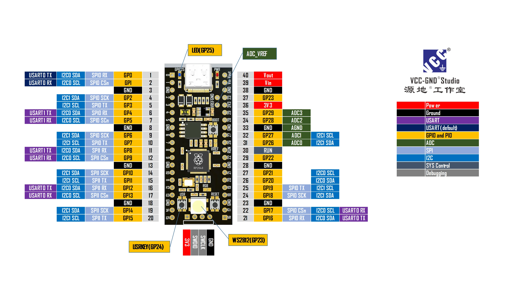

# Delta-1.0.1
RFID research Based Project with basic codings. Based on Circuit Python and RP-2040.

# The Work is in progress

The Whole project is based on T78, the runtime of the entire program is dependent on Certain Catagory.

## the proposition

visit the [Links for Polau](https://links.polau.win) to get known links.

## Hardware 
The Hardware used in this Project or the core brain of the Project is RP-2040 based pico board. Its a modified board of Raspberry Pi pico with more memory modulation.
The pico board is a modified board, RP-2040-YD. 

# 📸 Images of The RP-2040 Board Layout

  <b>Compact, Powerful, and Maker-Friendly — Unleash Creativity with RP-2040-YD</b>

## Usage

## Contributing

Pull requests are welcome. For major changes, please open an issue first
to discuss what you would like to change.

Please make sure to update tests as appropriate.

## License

[MIT](https://choosealicense.com/licenses/mit/)
